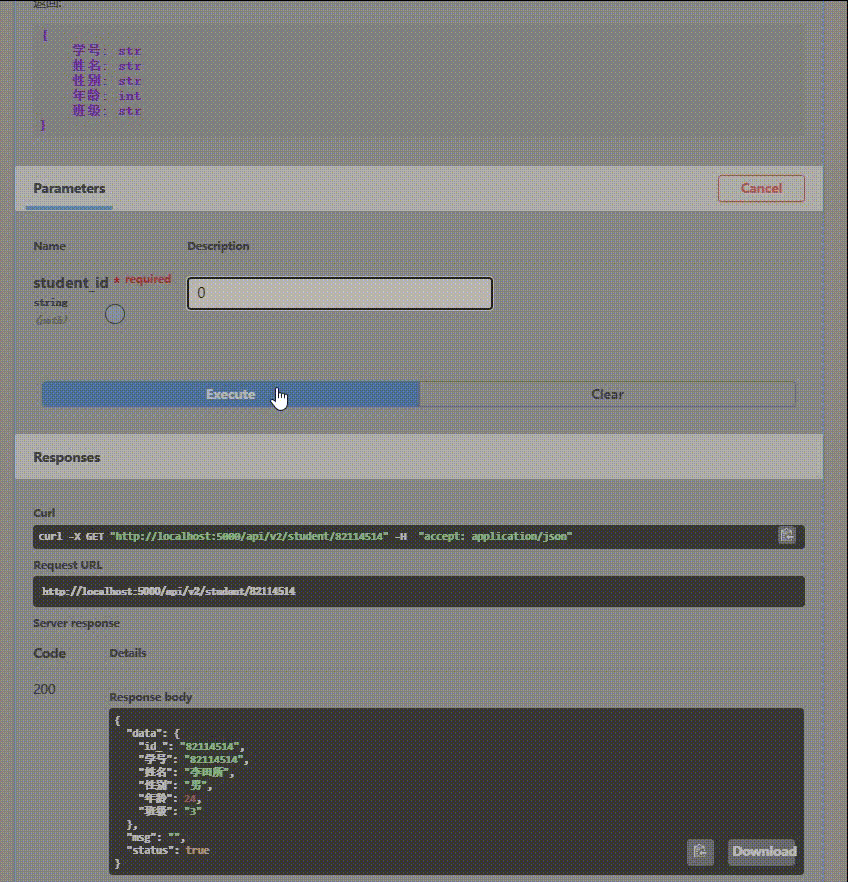
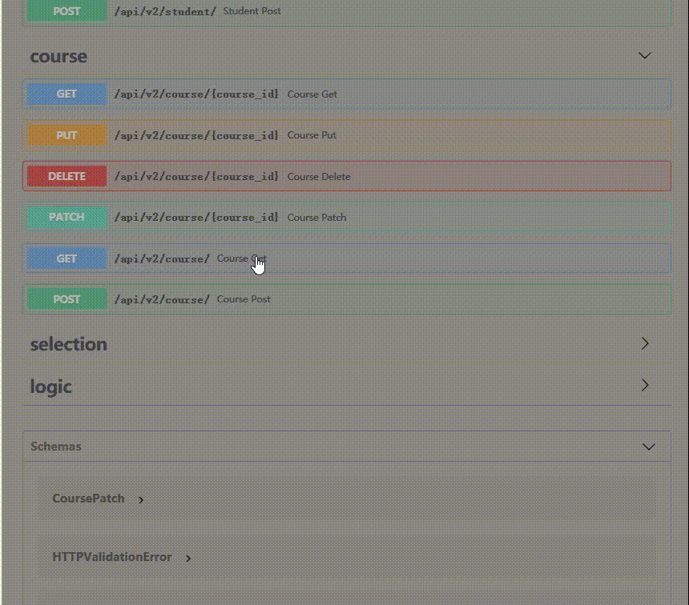
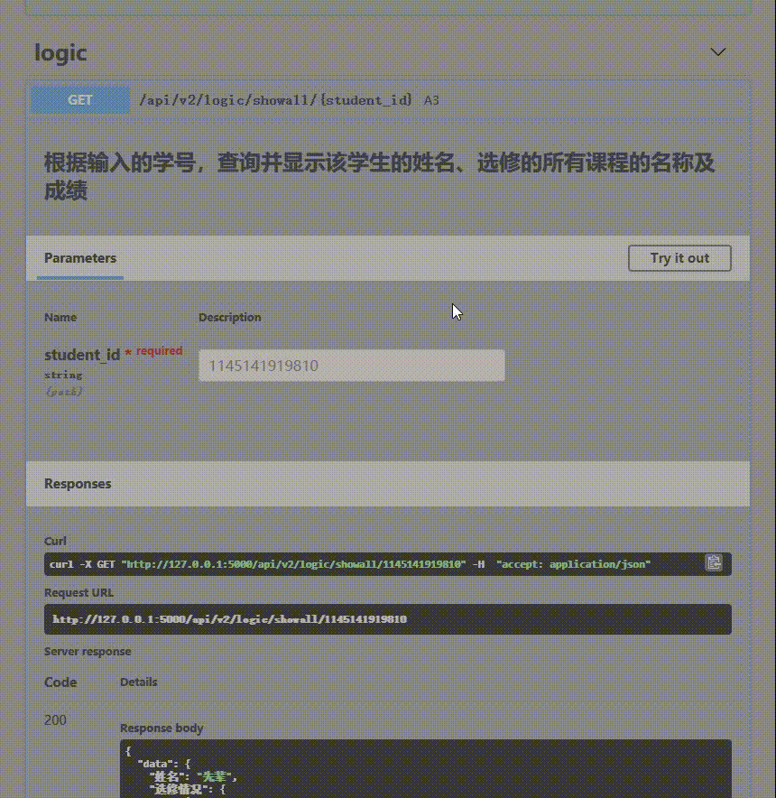

# 界面总览

# 开发环境

- python 3.8+
- pip    20.1+
- Windows Server 2019 Datacenter

> 但大概py3.7+都能跑

# 安装依赖

`pip install -r requirements.txt`

# 运行

`python main.py`

# 使用

浏览器访问[http://localhost:5000/docs](http://localhost:5000/docs)

# 说明

本项目简单实现了学生，课程和选课三类数据模型的增删查改交互。

完全的模块化编程，程序主要分为数据模型模块和http交互模块。

数据模型模块详见[models/](models/)

所有数据库中对象皆继承于Base类，并由该类负责维护唯一身份标识**id_**

并且实现：

- 增加(CREATE) -> save
- 删除(DELETE) -> delete
- 查询(RETRIEVE) -> objects
- 修改(UPDATE) -> update

四个基本接口。

数据存储方面实现了两种方式，一种是按照作业要求，将所有同类数据序列化为单个文件的存法。

一种是将id_字段作为索引值，每个对象单独存储的方法。(见Base_old.py)

后者会在数据量较大的时候对单对象读写有比较好的优化。

对于选课这个相当于外键的模型，本项目中并没有对学号引用和课程编号引用做强制检查。查询功能是动态搜索对应类的条目，如果不存在待检索的课程或学号则会抛出异常。但正确使用情况下功能是正常的。

# 功能演示

## 0. 三大模块的基本CRUD

## 1. 根据输入的学号，查询并显示某学生的基本信息

## 2. 根据输入的课程编号，查询并显示某课程的基本信息

## 3. 根据输入的学号，查询并显示该学生的姓名、选修的所有课程的名称及成绩(本来应该是前端的任务)

## 4. 根据给定的学号，查询并显示该生的平均成绩(本来也应该是前端的任务)

## 5. 删除一个学生的信息(见0.)